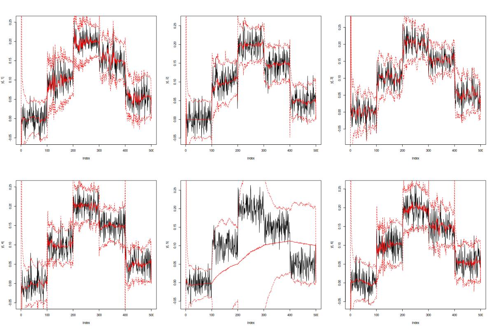
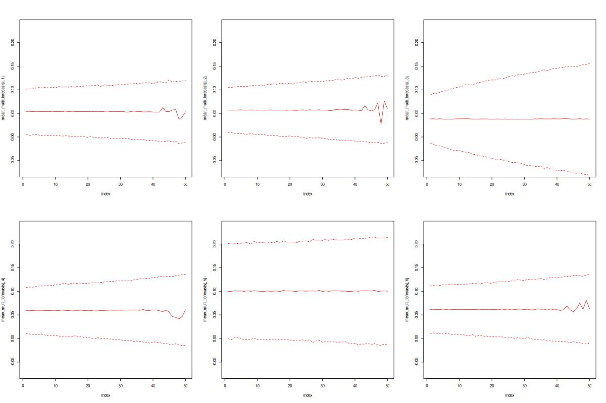

# GPU-accelerated software for online learning of the Simultaneous Graphical DLM

**rSGDLM** is an R package that implements the Variational Bayes method for online learning of the Simultaneous Graphical DLM presented in *GPU-Accelerated Bayesian Learning and Forecasting in Simultaneous Graphical Dynamic Linear Models* (https://doi.org/10.1214/15-BA946). A method for online selection of the simultaneous parental sets is described in *Bayesian online variable selection and scalable multivariate volatility forecasting in simultaneous graphical dynamic linear models* (https://doi.org/10.1016/j.ecosta.2017.03.003).

## Installation

Installation of the **rSGDLM** R package has been tested on a Linux computer equipped with a Quadro P2000 GPU and the CUDA toolkit 11.8 installed (download from https://developer.nvidia.com/cuda-toolkit-archive). The package can run on much older hardware and software, provided that the appropriate `gencode` flag is set via `configure.args`. The minimum required compute capability is 2.0 and the minimum required CUDA toolkit is 5.5; you can find out the compute capability of your GPU at https://developer.nvidia.com/cuda-gpus. Furthermore, Rcpp and C++ compilers are required.

If the `CUDA_HOME` environment variable is set to point to the local CUDA installation, and `$CUDA_HOME/lib64` and `$CUDA_HOME/include` are the directories containing the CUDA library and header files, respectively, **rSGDLM** can be installed from within R by calling

```r
devtools::install_github("lutzgruber/gpuSGDLM/rSGDLM") 
```

Custom CUDA library and header paths can be supplied to the installation routine via the `configure.args` installation argument,

```r
devtools::install_github("lutzgruber/gpuSGDLM/rSGDLM", configure.args = list(rSGDLM = c("--with-cuda-lib=CUDA_LIB_DIR", "--with-cuda-include=CUDA_INC_DIR"))) 
```

To specify a specific build architecture such as `arch=compute_35,code=sm_35`, use

```r
devtools::install_github("lutzgruber/gpuSGDLM/rSGDLM", configure.args = list(rSGDLM = "--with-nvcc-gencode='arch=compute_35,code=sm_35'")) 
```

To have nvcc use a specific C++ compiler such as `g++-13`, use

```r
devtools::install_github("lutzgruber/gpuSGDLM/rSGDLM", configure.args = list(rSGDLM = "--with-nvcc-flags='-ccbin g++-13'")) 
```

## Sample code

The syntax of the several **rSGDLM** package functions and expected input parameters are explained in the [rSGDLM.pdf](rSGDLM.pdf) file.

```r
# load package
library(rSGDLM)

# load module
M = Module("gpuSGDLM", "rSGDLM")

# define SGDLM
no_gpus=1
sgdlm1 = new(M$SGDLM, no_gpus)

# set simultaneous parental structure
p = c(3,4,3,2)
sp = matrix(c(NA, NA, 8, NA, NA, 1, 9, 13, NA, NA, NA, NA, 3, 7, NA, NA), max(p))
sgdlm1$setSimultaneousParents(p, sp)

# define m = number of series
m = 4

# set discount factors
beta = rep(.95,m)
delta = rep(.975,m)
sgdlm1$setDiscountFactors(beta, delta)

# set initial parameters
a = array(0, c(max(p), m))
R = array(0.05*diag(max(p)), c(max(p), max(p), m))
r = rep(1, m)
c = rep(.01, m)
sgdlm1$setPriorParameters(a, R, r, c)

# generate mock time series data
T=500
true_means=c(rep(0,T/5), rep(.1,T/5), rep(.2,T/5), rep(.15,T/5), rep(.05,T/5))
y=matrix(rnorm(m*T,true_means,.025),T)

mean_forecasts = array(0, c(T,m))
upper_bound_forecasts = array(0, c(T,m))
lower_bound_forecasts = array(0, c(T,m))

# filter data
for(t in 2:T) {
  print(t)

  # current observation of the data series
  y_t=y[t,]
  
  # time t predictors including values of simultaneous parental series
  F_t=array(0, c(max(p), m))
  F_t[1,1:3] = 1 # local intercept for series j=1,2,3
  F_t[2,c(1,3)] = y[t-1,c(1,3)] # AR1-term for series j=1,3
  F_t[3,3] = true_means[t] # true mean predictor for series j=3 (unrealistic in practice!)
  F_t[3,1] = y_t[3] # simultaneous parents for series j=1
  F_t[2:4,2] = y_t[c(1,3,4)] # simultaneous parents for series j=2
  F_t[1:2,4] = y_t[c(1,2)] # simultaneous parents for series j=4
  
  # compute naive posteriors
  sgdlm1$computePosterior(y_t, F_t)
  
  # compute VB-decoupled posterior
  parVB = sgdlm1$computeVBPosterior(10000, 10000)
  
  # set decoupled parameters, if effective sample size of importance sample is greater than 5000
  if (1/sum(parVB$IS_weights^2) > 5000) {
    sgdlm1$setPosteriorParameters(parVB$m, parVB$C, parVB$n, parVB$s)
  }
  
  # compute step-ahead prior
  sgdlm1$computePrior()
  
  if (t < T) {
    # external time t+1 predictors 
    F_tp1=array(0, c(max(p), m))
    F_tp1[1,1:3] = 1 # local intercept for series j=1,2,3
    F_tp1[2,c(1,3)] = y[t,c(1,3)] # AR1-term for series j=1,3
    F_tp1[3,3] = true_means[t+1] # true mean predictor for series j=3 (we are unlikely to know true means in the real world!)
  
    # compute forecasts 
    y.forecasts = sgdlm1$computeForecast(10000, 10000, F_tp1)
  
    mean_forecasts[t,] = apply(y.forecasts, 1, mean)
    upper_bound_forecasts[t,] = apply(y.forecasts, 1, function(x){quantile(x, .95)})
    lower_bound_forecasts[t,] = apply(y.forecasts, 1, function(x){quantile(x, .05)})
  }
}

# plot true data and forecasts
par(mfrow = c(2, 2))
plot(y[,1], type = 'l')
lines(mean_forecasts[,1], col = 'red')
lines(upper_bound_forecasts[,1], col = 'red', lty = 'dashed')
lines(lower_bound_forecasts[,1], col = 'red', lty = 'dashed')
plot(y[,2], type = 'l')
lines(mean_forecasts[,2], col = 'red')
lines(upper_bound_forecasts[,2], col = 'red', lty = 'dashed')
lines(lower_bound_forecasts[,2], col = 'red', lty = 'dashed')
plot(y[,3], type = 'l')
lines(mean_forecasts[,3], col = 'red')
lines(upper_bound_forecasts[,3], col = 'red', lty = 'dashed')
lines(lower_bound_forecasts[,3], col = 'red', lty = 'dashed')
plot(y[,4], type = 'l')
lines(mean_forecasts[,4], col = 'red')
lines(upper_bound_forecasts[,4], col = 'red', lty = 'dashed')
lines(lower_bound_forecasts[,4], col = 'red', lty = 'dashed')
```



### Evolution priors

The method `computeEvoPrior` accepts the evolution matrices `G_tp1` as an input argument.

```r
sgdlm1$computePosterior(y_t, F_t)

print(sgdlm1$getParameters()$m)

sgdlm1$computeEvoPrior(
  G_tp1 = array(1.1 * diag(max(p)), c(max(p), max(p), m))
)

print(sgdlm1$getParameters()$m)
```

### Multi-step forecasts

The `computeForecast` method creates multi step ahead forecasts, if the input argument `F_tp1` is an array with more than one entry in the third dimension. The `computeEvoForecast` method accepts an additional input `G_tp1` for multi-step ahead prior evolutions; `G_tp1` can be a 3D for time-invariant evolutions or a 4D array time-varying evolutions.

```r
multi_step_forecasts = sgdlm1$computeForecast(
  nsim = 10000,
  nsim_batch = 10000,
  F_tp1 = array(F_tp1, c(dim(F_tp1), 5))
)
mean_forecasts = t(apply(multi_step_forecasts, c(1, 3), mean))
upper_bound_forecasts = t(apply(multi_step_forecasts, c(1, 3), quantile, .95, na.rm = TRUE))
lower_bound_forecasts = t(apply(multi_step_forecasts, c(1, 3), quantile, .05, na.rm = TRUE))

par(mfrow = c(2, 2))
plot(mean_forecasts[,1], ylim = c(min(lower_bound_forecasts, na.rm = TRUE), max(upper_bound_forecasts, na.rm = TRUE)), type = 'l', col = 'red')
lines(upper_bound_forecasts[,1], col = 'red', lty = 'dashed')
lines(lower_bound_forecasts[,1], col = 'red', lty = 'dashed')
plot(mean_forecasts[,2], ylim = c(min(lower_bound_forecasts, na.rm = TRUE), max(upper_bound_forecasts, na.rm = TRUE)), type = 'l', col = 'red')
lines(upper_bound_forecasts[,2], col = 'red', lty = 'dashed')
lines(lower_bound_forecasts[,2], col = 'red', lty = 'dashed')
plot(mean_forecasts[,3], ylim = c(min(lower_bound_forecasts, na.rm = TRUE), max(upper_bound_forecasts, na.rm = TRUE)), type = 'l', col = 'red')
lines(upper_bound_forecasts[,3], col = 'red', lty = 'dashed')
lines(lower_bound_forecasts[,3], col = 'red', lty = 'dashed')
plot(mean_forecasts[,4], ylim = c(min(lower_bound_forecasts, na.rm = TRUE), max(upper_bound_forecasts, na.rm = TRUE)), type = 'l', col = 'red')
lines(upper_bound_forecasts[,4], col = 'red', lty = 'dashed')
lines(lower_bound_forecasts[,4], col = 'red', lty = 'dashed')
```

